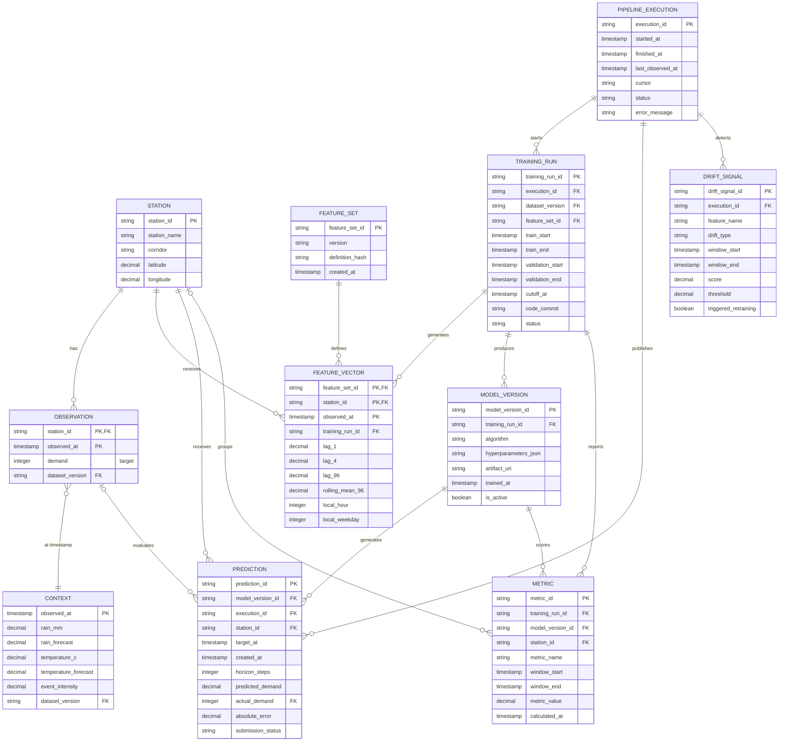

# Modelo entidad-relación para Machine Learning

El modelo conserva los datos fuente sin sobrescribirlos y separa la generación
de features, los experimentos, los modelos publicados, las predicciones y el
monitoreo. Todas las entidades temporales usan timestamps con zona horaria.

## Decisiones de diseño

### Grano de las tablas fuente

- `OBSERVATION` tiene una fila por estación y timestamp. Su clave primaria es
  `(station_id, observed_at)`; `demand` es el objetivo que se quiere predecir.
- `CONTEXT` tiene una fila por timestamp y se relaciona con todas las estaciones
  mediante `observed_at`. Esto evita duplicar clima y eventos 12 veces.
- `STATION` conserva los ceros iniciales del identificador y las coordenadas
  para features geográficas y visualizaciones.

### Reproducibilidad del entrenamiento

- `FEATURE_SET` versiona la definición y el hash de las variables.
- `FEATURE_VECTOR` conserva el valor calculado de cada feature en el grano
  estación-timestamp. Así se pueden reconstruir predicciones y auditar fugas de
  información.
- `TRAINING_RUN` registra el cutoff y las ventanas temporales. La validación
  debe ocurrir después de `train_end` y antes de `validation_end`.
- `MODEL_VERSION` apunta al artefacto exacto y al commit que lo produjo. Solo
  una versión debería estar activa para cada objetivo y horizonte.

### Predicción y monitoreo

- `PREDICTION` permite almacenar cuatro horizontes usando `horizon_steps` y
  deja `actual_demand` vacío hasta que la observación real esté disponible.
- `METRIC` soporta WAPE, accuracy y métricas rolling, tanto globales como por
  estación y modelo.
- `PIPELINE_EXECUTION` conserva el cursor o último timestamp procesado para
  que la operación incremental sea reanudable e idempotente.
- `DRIFT_SIGNAL` registra data drift y concept drift, el umbral aplicado y si
  la señal provocó reentrenamiento.

## Restricciones recomendadas

1. No permitir features calculadas con timestamps posteriores a `observed_at`.
2. Unicidad en `PREDICTION` para `(model_version_id, station_id, target_at,
   horizon_steps)`.
3. Validar que `actual_demand` corresponda al mismo `station_id` y `target_at`.
4. Mantener inmutables `OBSERVATION`, `CONTEXT`, `FEATURE_VECTOR` y las
   versiones de modelo; las correcciones deben producir una nueva versión.
5. Indexar `observed_at`, `(station_id, observed_at)`, `target_at` y
   `execution_id` para ingesta, backtesting y dashboard.